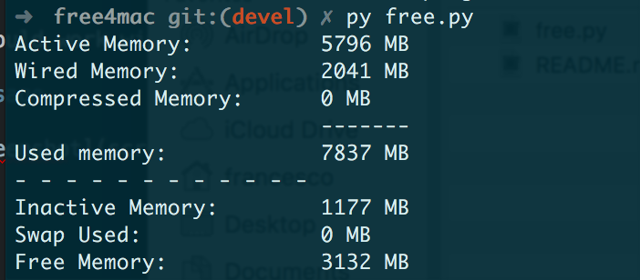

# freemem

Equivalent of `free` for Mac.

### requirements

- It should work with OS X 10.8+. Tested on Yosemite.
- python 2.6+

#### installation

1. `sudo cp freemem.py /usr/local/bin/freemem`

2. `sudo chmod +x /usr/local/bin/freemem`

### usage

